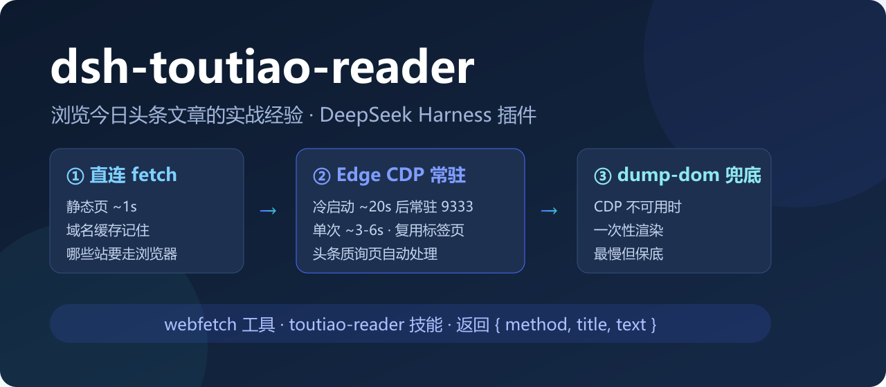

<p align="center"></p>

# dsh-toutiao-reader

[English](README.md) | 中文

**把「浏览今日头条文章」的实战经验打包成 DeepSeek Harness (DSH) 插件**：一个 `webfetch` 工具 + 一个 `toutiao-reader` 技能。

```
模型调用 webfetch(url)
   ├─ ① direct-fetch        静态直连 ~1s（域名缓存记住哪些站必须走浏览器）
   ├─ ② Edge CDP 常驻无头    首次冷启动 ~20s → 常驻端口 9333，单次 ~3-6s
   │     · 复用常驻标签页（省 ~4s）      · 禁图 + 屏蔽字节跳动 CDN 提速
   │     · 头条质询页（安全验证/__ac_signature/acrawler）自动等 reload 宽限窗口
   └─ ③ dump-dom 兜底        CDP 不可用时一次性渲染
```

## 为什么需要它

今日头条的静态 HTML 必命中反爬（`__ac_nonce`/`__ac_signature`/`acrawler`），普通 fetch 只能拿到「安全验证」页；`web_search` 又只给摘要。这个插件把两者之间的空白补上：**给一个文章 URL，返回标题 + 全文纯文本**。对头条做了专门优化，同时对一般网页（博客、新闻站、国内站直连可达者）同样适用。

## 提供什么

### 工具：`webfetch`

| 参数 | 类型 | 说明 |
|---|---|---|
| `url` | string，必填 | 文章 URL（头条 PC 页支持最好；移动/分享页多为 App 引导页，无文字正文） |
| `maxChars` | number | 返回正文上限，默认 12000，≤60000，超出置 `truncated` |
| `outfile` | string | 可选：全文落盘（title+空行+正文）；绝对路径或相对 `workspace` 配置 |

返回：`{ method, title, text, textLength, truncated, outfile?, error? }`

- 失败以 `{ error }` 形态返回，不抛异常，主流程永不被抓取拖垮
- 声明 `isConcurrencySafe: false`（CDP 复用同一标签页，强制串行）与 `timeoutMs: 120000`
- `method` 字段告诉你走了哪条路，方便判断「快」还是「被反爬了」

### 技能：`toutiao-reader`

随插件注册的经验文档（模型可自动调用）：头条 URL 形态表、`method` 字段解读、质询页处理与重试节奏、正文过短的排查（视频页/问答页/App 引导页）、常驻浏览器管理（端口/pid/停止命令）、网络环境注意事项（curl 不可靠、代理、沙箱重定向）、后备脚本路径。

## 安装

### 方式一：插件市场（推荐）

DSH Web → 设置 → **插件市场** → 搜索 `toutiao` → 安装。

### 方式二：CLI

```sh
dsh plugin --profile web add dsh-toutiao-reader
```

### 方式三：手动（本地开发）

```powershell
# junction 进 profile（无需管理员）
New-Item -ItemType Junction -Path "$env:USERPROFILE\.dsh\profiles\web\node_modules\dsh-toutiao-reader" -Target "<插件目录>"
# profile package.json：dependencies 加 "dsh-toutiao-reader": "link:<插件目录>"，bundles 数组加 "dsh-toutiao-reader"
```

装完重启 dsh web 生效。**不要在 profile 目录里跑 pnpm install**（会把官方包复制成物理副本，详见 dsh 社区经验）。

## 配置

在 profile 的 `cordis.patch.yml` 用 **id 覆盖模式**（只写 id，不要重复 insert）：

```yaml
- id: dsh-toutiao-reader
  config:
    workspace: D:/DSH_Workspace  # 相对 outfile 的解析基准
    cdpPort: 9333                # CDP 调试端口
    browserPath: ""              # Edge/Chrome 路径覆盖，空则自动探测
    maxChars: 12000              # 默认返回正文上限
    domainCachePath: ""          # 域名缓存路径，空则 %TEMP%/webfetch-domains.json
```

## 常见问题

**抓取很慢？** 首次冷启动常驻浏览器 ~20s 属正常；之后单次 ~3-6s。CDP 阶段禁图、屏蔽字节 CDN 是刻意提速。

**正文很短或为空？** 多为视频页/问答页/App 引导页（移动分享页实测仅有 ~40 字引导文案）。换 **PC 版链接**（`www.toutiao.com/article/<id>/`）通常可解。

**遇到「安全验证」循环？** 等几秒重试一次即可；不要高频重试（触发更严风控）。同一域名解过一次会被域名缓存记住。

**浏览器状态坏了？** 读 `%TEMP%\webfetch-edge.pid` 后 `taskkill /PID <pid> /T /F`，下次调用自动冷启动。

**已有一键脚本？** 与工作区脚本 `node tools/webfetch.mjs <url> [outfile]` **共享同一个常驻浏览器和标签页**（同名 pid/tab/profile 文件），互相加速；插件不可用时脚本就是后备路径。

## 安全与隐私

- 只读抓取：不写文件（除非显式传 `outfile`）、不读凭据、不上报任何数据
- 常驻无头浏览器仅监听本机回环（127.0.0.1）
- 域名缓存只存「该域是否需要浏览器」一个字符串，无任何内容记录

## 兼容性

- 需要本机装有 Edge 或 Chrome（自动探测；可用 `browserPath` 指定）
- Node.js ≥ 20（依赖全局 fetch / WebSocket / AbortSignal.any）；DSH web 0.1.0-rc.6+ 测试通过
- 境外站点直连超时时，可参考技能文档里的代理建议

## License

[MIT](LICENSE)
